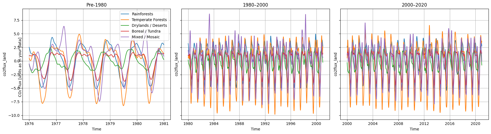
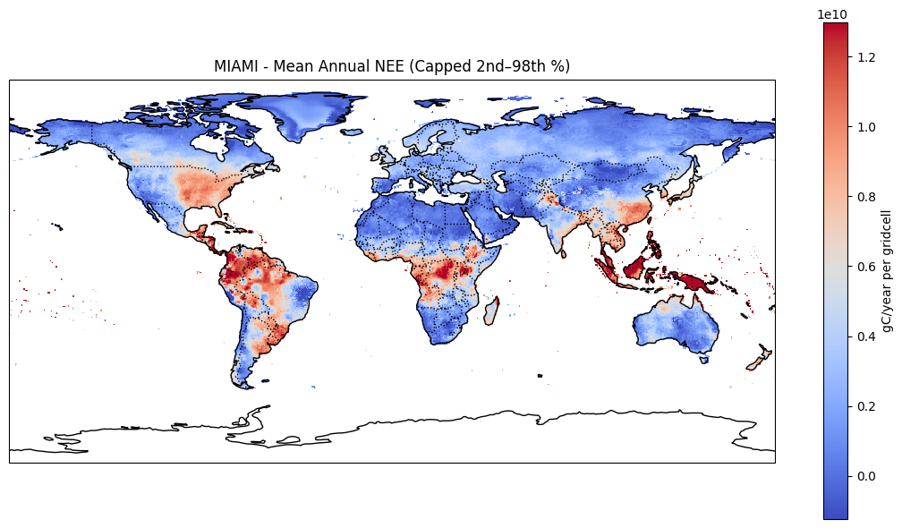
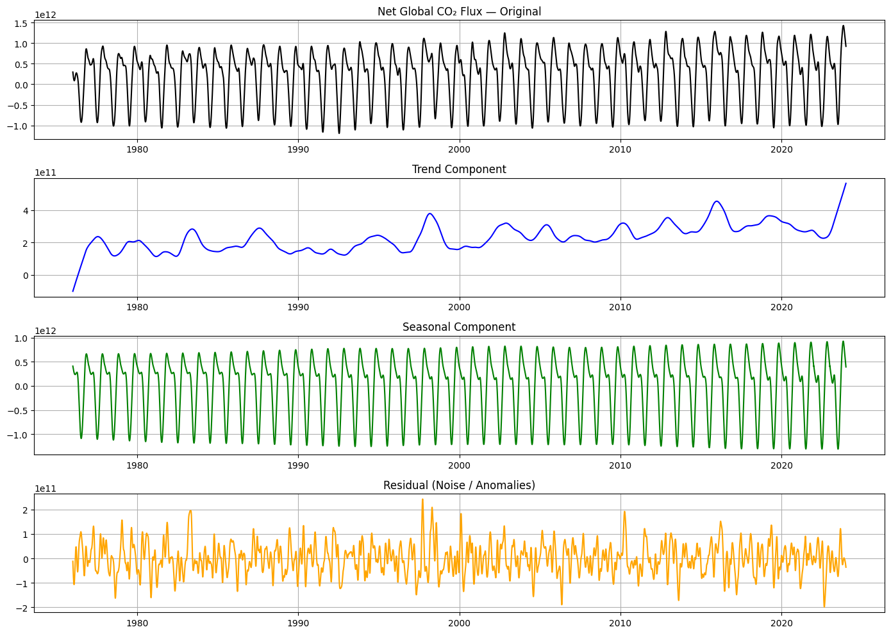
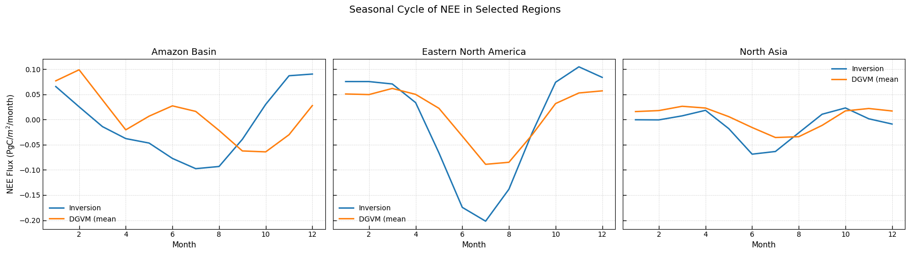

# Environmental-Data-Analysis
Spatio-temporal data analysis of terrestrial CO2 fluxes from the JenaCarboScope model and A.D.Friend's miami extended model in Python. The model was ran separately, but this is the data analysis part. The analysis is tructured in 3 different stages: 1) JenaCarboScope; 2) Miami; 3) Model Intercomparison

### Vegetation Seasonal Cycle Analysis

This is a **time-series analysis of seasonal cycles** for specific vegetation types.  
It was used to see how different plants are modelled and which ones absorb the most carbon.  
This analysis is based on results from the **Jena Model**.

---

---

### Spatial Plot of MIAMI Output

The **blue regions** show carbon uptake, while the **red** ones show carbon emission.  
It was found that the model had extreme outliers, so we capped the first and last 2%.  
This adjustment does not affect the results.

  

[Watch the Jena simulation](download.mp4)
---

### Seasonal-Trend Decomposition

Because environmental data shows both **seasonal signals** and **long-term trends**  
(due to changes in CO₂ or yearly climate variation), we performed a  
**Seasonal-Trend decomposition (STL)**.  

This allows us to see more clearly how each model captures the **seasonality**, **trends**,  
and **anomalies** — particularly useful when comparing models of global CO₂ fluxes.

  

---

### Regional Analysis

This was a fun exercise where we looked at each model’s ability  
to capture different **geographic regions** most often analysed in the literature,  
due to their distinct vegetation types — for example:  
**tropical rainforests (Amazon)**, **tundra forests (Northern Asia)**,  
and **deciduous forests (Eastern North America)**.  

This is only an excerpt; the full analysis was done on over **12 regions**.

  

